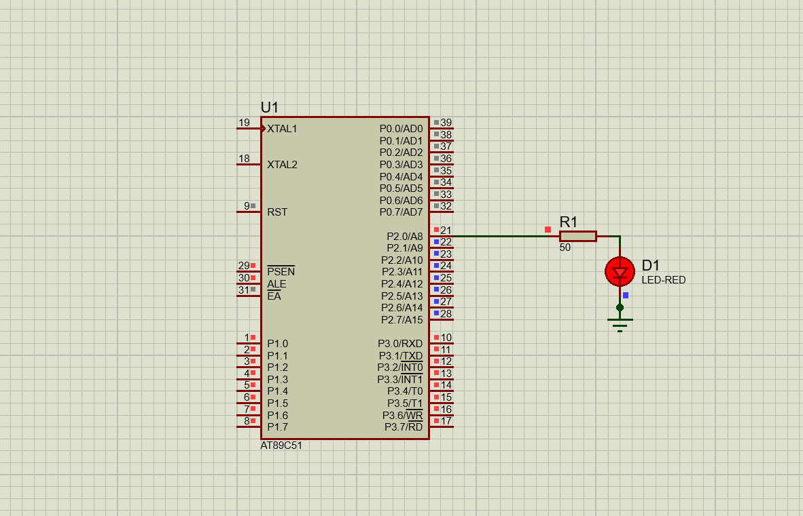

# LED Blink (8051 Microcontroller)

## Description
This project demonstrates a basic LED blinking program using the 8051 microcontroller. The LED turns ON and OFF at a fixed time interval, serving as the simplest starting project for beginners.

## Files
- `led_blink.c` – Source code
- `led_blink.hex` – Compiled HEX file
- `led_blink.pdsprj` – Proteus simulation project
- `led_blink.png` – Circuit Simulation

## Circuit Simulation

## Requirements
- Keil uVision (for compiling the code)
- Proteus Design Suite (for simulation)
- AT89C51 / AT89S52 Microcontroller
- LED, resistor, and supporting hardware

## Procedure
1. Open `led_blink.c` in **Keil uVision**.
2. Compile the code to generate the `.hex` file.
3. Open `led_blink.pdsprj` in **Proteus**.
4. Assign the generated `.hex` file to the microcontroller in the schematic.
5. Run the simulation or upload to real hardware to observe the LED blinking.
