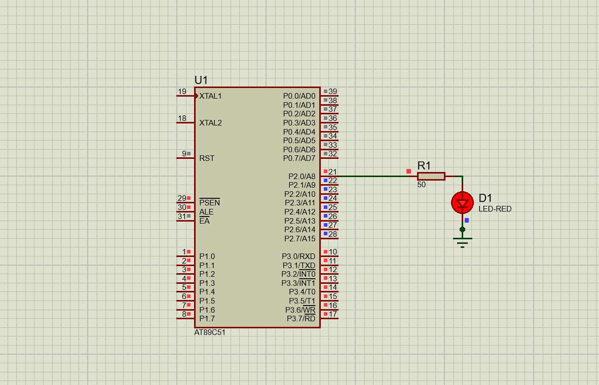

# LED Blink (8051 Microcontroller)

## 📜 Description
A simple program to blink an LED at a fixed interval using the 8051 microcontroller.

## 📂 Files
- `LED_Blink.c` — C source code
- `LED_Blink.hex` — Compiled HEX file
- `LED_Blink.pdsprj` — Proteus design file

## 🖼 Output

## 🛠 Requirements
- Keil uVision
- Proteus Design Suite
- AT89C51/AT89S52 Microcontroller

## 🔹 Procedure
1. Open `LED_Blink.c` in **Keil uVision**.
2. Compile the code (`F7` or Build option) to generate the `.hex` file.
3. Open `LED_Blink.pdsprj` in **Proteus**.
4. Double-click on the microcontroller component in Proteus and load the generated `.hex` file.
5. Run the simulation to see the LED blinking.