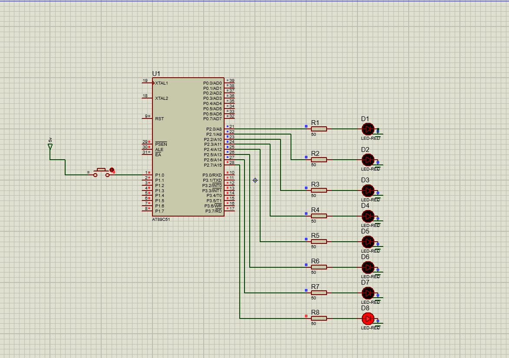

# LED Pattern (8051 Microcontroller)

## 📜 Description
LEDs blink in a predefined sequence to form a pattern.

## 📂 Files
- `LED_Pattern.c`
- `LED_Pattern.hex`
- `LED_Pattern.pdsprj`

## 🖼 Output

## 🛠 Requirements
- Keil uVision
- Proteus Design Suite
- AT89C51/AT89S52 Microcontroller

## 🔹 Procedure
1. Open `LED_Pattern.c` in **Keil uVision**.
2. Compile to create the `.hex` file.
3. Open the `.pdsprj` file in **Proteus**.
4. Load the `.hex` file into the microcontroller in the Proteus schematic.
5. Run simulation to observe the LED pattern sequence.
