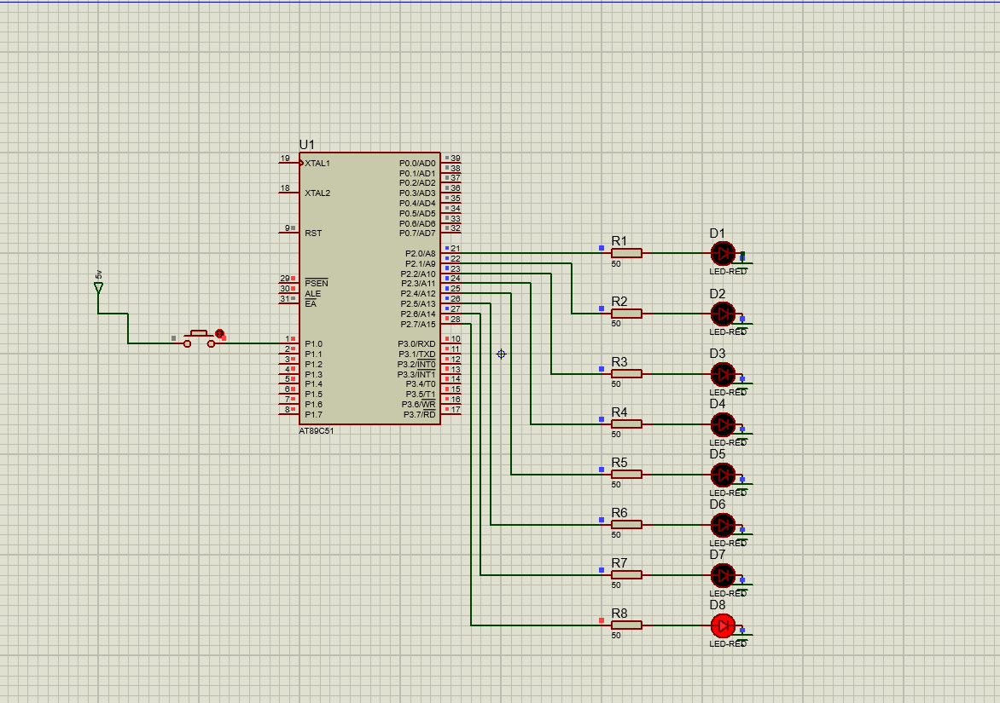

# LED Pattern (8051 Microcontroller)

## Description
This project demonstrates blinking LEDs in a predefined sequence to form a pattern using the 8051 microcontroller.

## Files
- `led_pattern.c` – Source code
- `led_pattern.hex` – Compiled HEX file
- `led_pattern.pdsprj` – Proteus simulation project
- `led_pattern.png` – Circuit Simulation

## Circuit Simulation

## Requirements
- Keil uVision (for compiling the code)
- Proteus Design Suite (for simulation)
- AT89C51 / AT89S52 Microcontroller
- LEDs, resistors, and supporting hardware

## Procedure
1. Open `led_pattern.c` in **Keil uVision**.
2. Compile the code to generate the `.hex` file.
3. Open `led_pattern.pdsprj` in **Proteus**.
4. Load the `.hex` file into the microcontroller in the schematic.
5. Run the simulation or upload to real hardware to observe the LED sequence.
