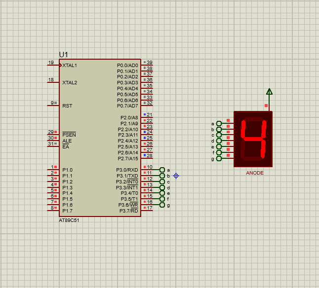
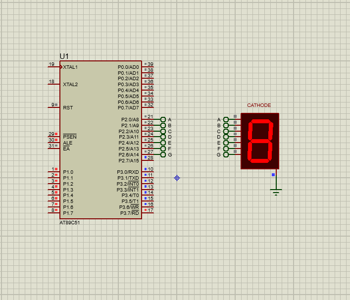

# Seven Segment Display (8051 Microcontroller)

## Description
This project demonstrates displaying numbers on a seven-segment display using the 8051 microcontroller. Both common-anode and common-cathode seven-segment displays are implemented.

## Files
- `seven_segment_display.c` – Source code
- `seven_segment_display.hex` – Compiled HEX file
- `seven_segment_display.pdsprj` – Proteus simulation project
- `seven_segment_display_anode.png` – Output with common-anode display
- `seven_segment_display_cathode.png` – Output with common-cathode display

## Circuit Simulation
**Common Anode Display**  
  

**Common Cathode Display**  

## Requirements
- Keil uVision (for compiling the code)
- Proteus Design Suite (for simulation)
- AT89C51 / AT89S52 Microcontroller
- Seven-segment display (common-anode and common-cathode)
- Resistors and supporting hardware

## Procedure
1. Open `seven_segment_display.c` in **Keil uVision**.
2. Compile the code to generate the `.hex` file.
3. Open `seven_segment_display.pdsprj` in **Proteus**.
4. Load the compiled `.hex` file into the microcontroller.
5. Run the simulation to observe numbers displayed on both types of seven-segment displays.
