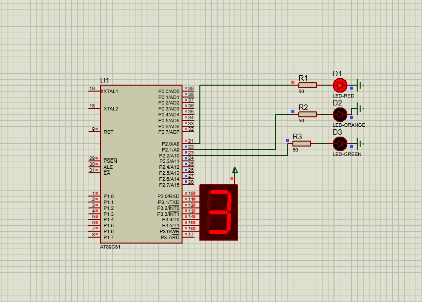

# Traffic Signal with Seven Segment Display (8051 Microcontroller)

## 📜 Description
Simulates a traffic signal system with countdown timer on a 7-segment display.

## 📂 Files
- `Traffic_Signal.c`
- `Traffic_Signal.hex`
- `Traffic_Signal.pdsprj`

## 🖼 Output

## 🛠 Requirements
- Keil uVision
- Proteus Design Suite
- AT89C51/AT89S52 Microcontroller

## 🔹 Procedure
1. Open `Traffic_Signal.c` in **Keil uVision**.
2. Compile the code to generate `.hex`.
3. Open `Traffic_Signal.pdsprj` in **Proteus**.
4. Load `.hex` into the 8051 microcontroller in Proteus.
5. Run simulation to observe the traffic signal and countdown timer operation.
