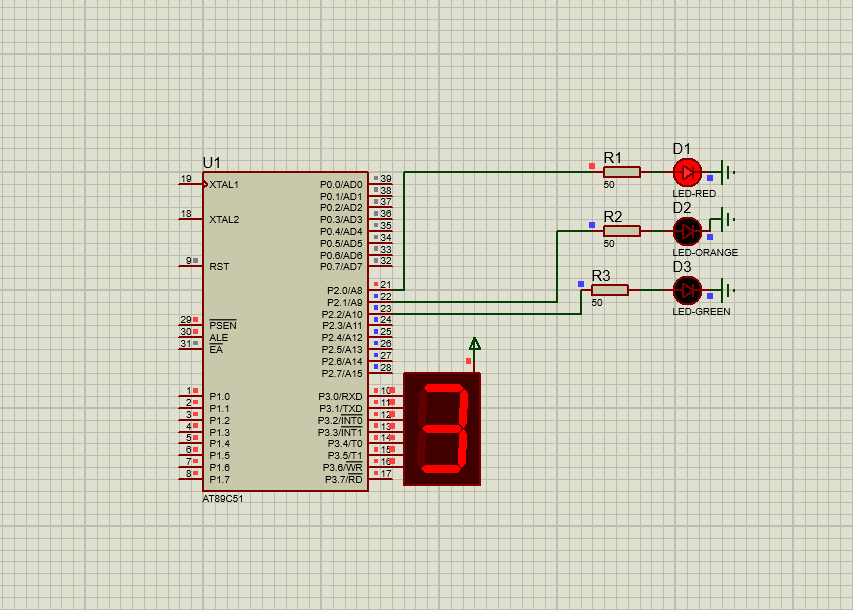

# Traffic Signal with Seven Segment Display (8051 Microcontroller)

## Description
This project simulates a traffic signal system using the 8051 microcontroller. A countdown timer is displayed on a seven-segment display, while LEDs represent the red, yellow, and green traffic lights.

## Files
- `traffic_signal.c` – Source code
- `traffic_signal.hex` – Compiled HEX file
- `traffic_signal.pdsprj` – Proteus simulation project
- `traffic_signal.png` – Circuit Simulation

## Circuit Simulation

## Requirements
- Keil uVision (for compiling the code)
- Proteus Design Suite (for simulation)
- AT89C51 / AT89S52 Microcontroller
- Seven-segment display
- LEDs (Red, Yellow, Green)
- Resistors and supporting hardware

## Procedure
1. Open `traffic_signal.c` in **Keil uVision**.
2. Compile the code to generate the `.hex` file.
3. Open `traffic_signal.pdsprj` in **Proteus**.
4. Load the compiled `.hex` file into the microcontroller.
5. Run the simulation to observe the traffic signal operation along with the countdown timer.
