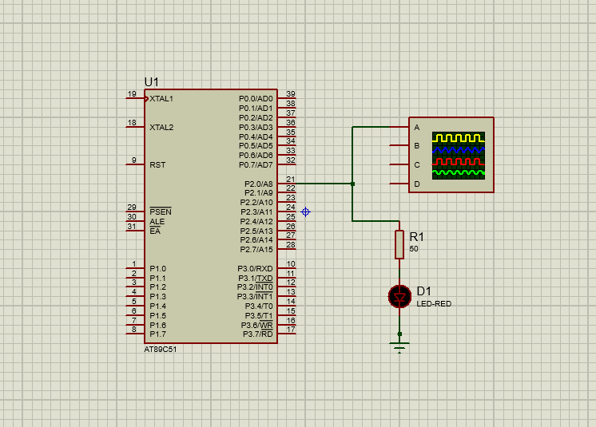
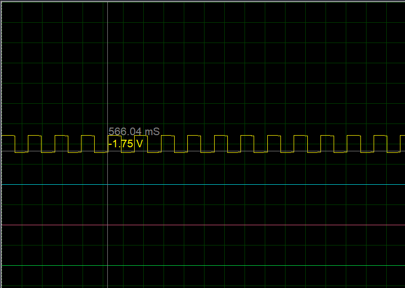
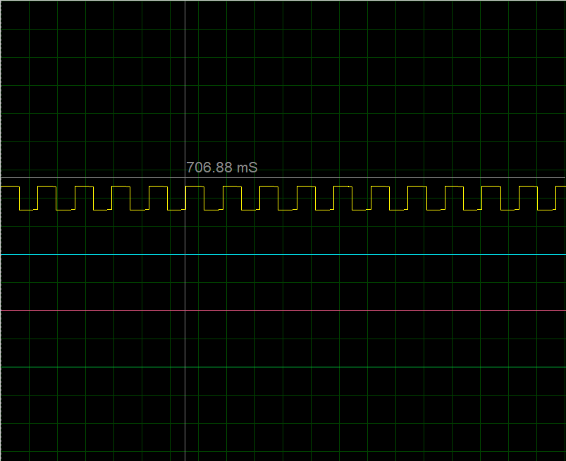

# Timer (8051 Microcontroller)

## 📜 Description
Using the 8051’s internal timer to generate delays.

## 📂 Files
- `Timer.c`
- `Timer.hex`
- `Timer.pdsprj`

## 🖼 Output
  
  

## 🛠 Requirements
- Keil uVision
- Proteus Design Suite
- AT89C51/AT89S52 Microcontroller

## 🔹 Procedure
1. Open `Timer.c` in **Keil uVision**.
2. Compile to generate `.hex`.
3. Open the Proteus project file.
4. Load `.hex` file into the microcontroller.
5. Run simulation to observe delay-based operations.
