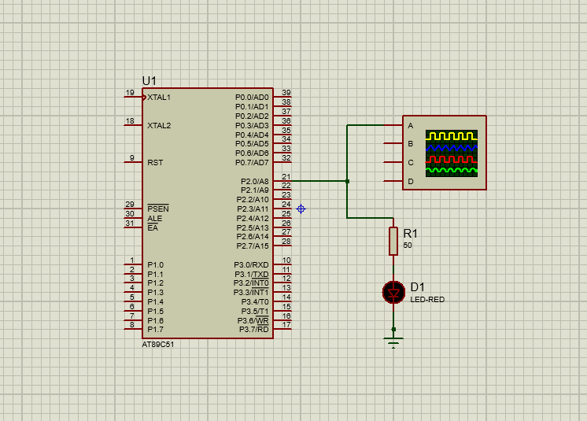
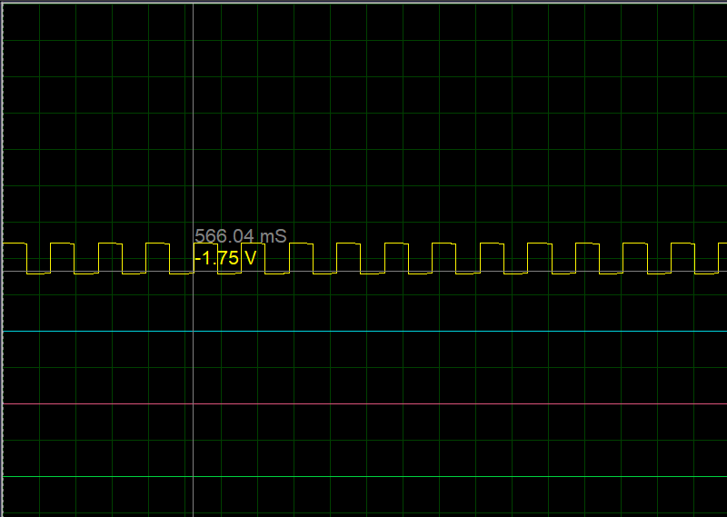

# Timer (8051 Microcontroller)

## Description
This project demonstrates the use of the 8051 microcontroller’s internal timer to generate accurate delays, which can be used in various applications such as LED blinking, event timing, and signal generation.

## Files
- `timer.c` – Source code
- `timer.hex` – Compiled HEX file
- `timer.pdsprj` – Proteus simulation project
- `timer_1.png`, `timer_2.png`, `timer_3.png` – Circuit Simulations

## Circuit Simulation
  
  

## Requirements
- Keil uVision (for compiling the code)
- Proteus Design Suite (for simulation)
- AT89C51 / AT89S52 Microcontroller

## Procedure
1. Open `timer.c` in **Keil uVision**.
2. Compile the code to generate the `.hex` file.
3. Open `timer.pdsprj` in **Proteus**.
4. Load the compiled `.hex` file into the microcontroller.
5. Run the simulation to observe the delay-based operations.
