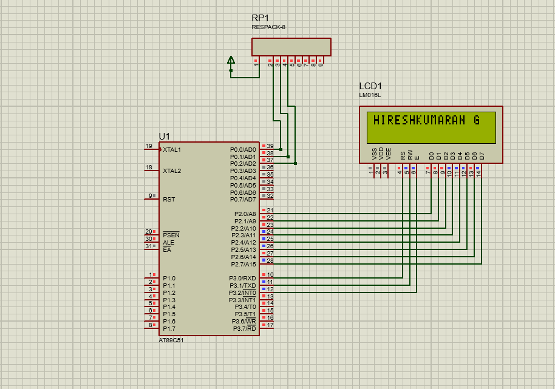

# LCD Display Interface (8051 Microcontroller)

## Description
This project demonstrates interfacing a 16x2 LCD with the 8051 microcontroller to display custom text and messages. It highlights how to initialize the LCD, send commands, and display characters.

## Files
- `lcd_display.c` – Source code
- `lcd_display.hex` – Compiled HEX file
- `lcd_display.pdsprj` – Proteus simulation project
- `lcd_display.png` – Circuit Simulation 

## Circuit Simulation

## Requirements
- Keil uVision (for compiling the code)
- Proteus Design Suite (for simulation)
- AT89C51 / AT89S52 Microcontroller
- 16x2 LCD Display

## Procedure
1. Open `lcd_display.c` in **Keil uVision**.
2. Compile the code to generate the `.hex` file.
3. Open `lcd_display.pdsprj` in **Proteus**.
4. Load the `.hex` file into the microcontroller in Proteus.
5. Run the simulation to view the text displayed on the LCD.
