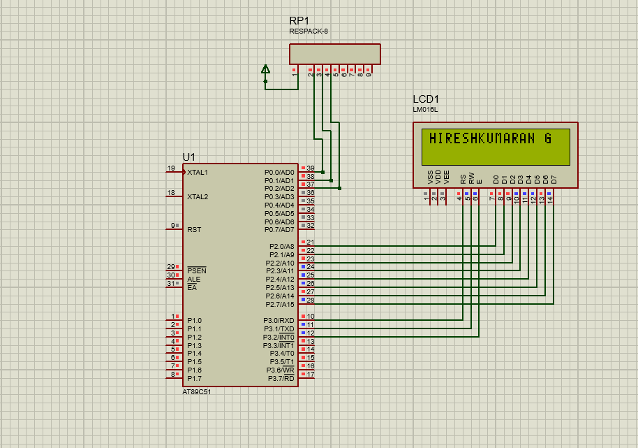

# LCD Display Interface (8051 Microcontroller)

## 📜 Description
Interfacing a 16x2 LCD Display with the 8051 microcontroller to display text.

## 📂 Files
- `LCD_Display.c`
- `LCD_Display.hex`
- `LCD_Display.pdsprj`

## 🖼 Output

## 🛠 Requirements
- Keil uVision
- Proteus Design Suite
- AT89C51/AT89S52 Microcontroller

## 🔹 Procedure
1. Open `LCD_Display.c` in **Keil uVision**.
2. Compile the code to create `.hex`.
3. Open the `.pdsprj` in **Proteus**.
4. Load `.hex` file into the microcontroller.
5. Run simulation to display text on LCD.
