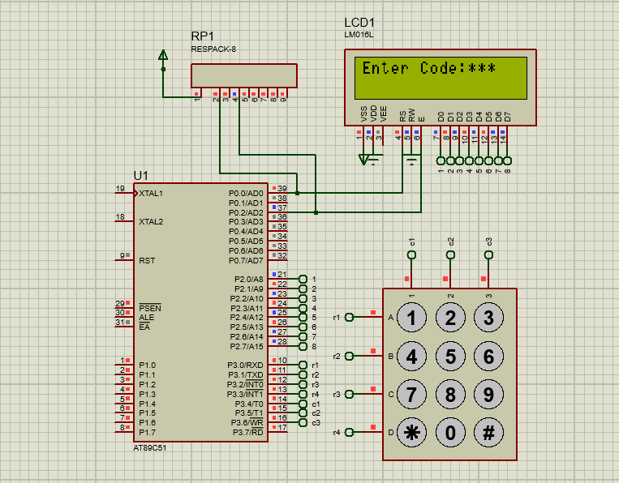

# Keypad with LCD (8051 Microcontroller)

## 📜 Description
Integrating a matrix keypad with a 16x2 LCD to display pressed keys.

## 📂 Files
- `Keypad_with_LCD.c`
- `Keypad_with_LCD.hex`
- `Keypad_with_LCD.pdsprj`

## 🖼 Output
  

## 🛠 Requirements
- Keil uVision
- Proteus Design Suite
- AT89C51/AT89S52 Microcontroller

## 🔹 Procedure
1. Open `Keypad_with_LCD.c` in **Keil uVision**.
2. Compile the code to produce `.hex`.
3. Open the `.pdsprj` file in **Proteus**.
4. Load `.hex` file into the microcontroller.
5. Run simulation and press keypad buttons to see them displayed on the LCD.
