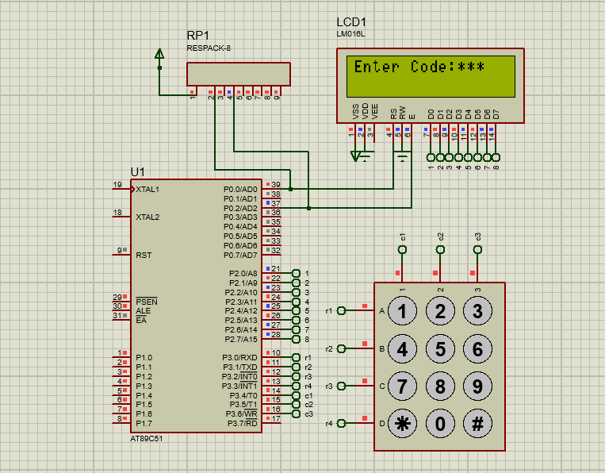

# Keypad with LCD (8051 Microcontroller)

## Description
This project demonstrates interfacing a 4x4 matrix keypad with a 16x2 LCD using the 8051 microcontroller. When a key is pressed on the keypad, the corresponding character is detected and displayed on the LCD.

## Files
- `keypad_with_lcd.c` – Source code
- `keypad_with_lcd.hex` – Compiled HEX file
- `keypad_with_lcd.pdsprj` – Proteus simulation project
- `keypad_with_lcd.png` – Circuit Simulation

## Circuit Simulation

## Requirements
- Keil uVision (for compiling the code)
- Proteus Design Suite (for simulation)
- AT89C51 / AT89S52 Microcontroller
- 16x2 LCD Display
- 4x4 Matrix Keypad

## Procedure
1. Open `keypad_with_lcd.c` in **Keil uVision**.
2. Compile the code to generate the `.hex` file.
3. Open `keypad_with_lcd.pdsprj` in **Proteus**.
4. Load the `.hex` file into the microcontroller in Proteus.
5. Run the simulation and press keypad buttons to view the corresponding characters on the LCD.
