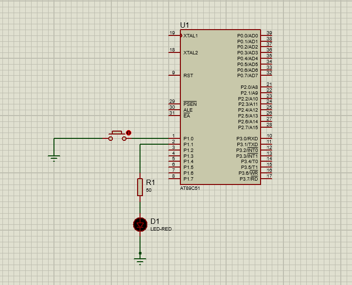

# Switch_Debounce (8051 Microcontroller)

## 📜 Description
Demonstrates reliable push-button input detection by eliminating false triggers caused by mechanical bouncing. An LED toggles on each valid button press.

## 📂 Files
- `Switch_Debounce.c` — C source code
- `Switch_Debounce.hex` — Compiled HEX file
- `Switch_Debounce.pdsprj` — Proteus design file

## 🖼 Output

## 🛠 Requirements
- Keil uVision
- Proteus Design Suite
- AT89C51/AT89S52 Microcontroller

## 🔹 Procedure
1. Open `Switch_Debounce.c` in **Keil uVision**.
2. Compile the code (`F7` or Build option) to generate the `.hex` file.
3. Open `Switch_Debounce.pdsprj` in **Proteus**.
4. Double-click on the microcontroller component in Proteus and load the generated `.hex` file.
5. Run the simulation to see the LED blinking.