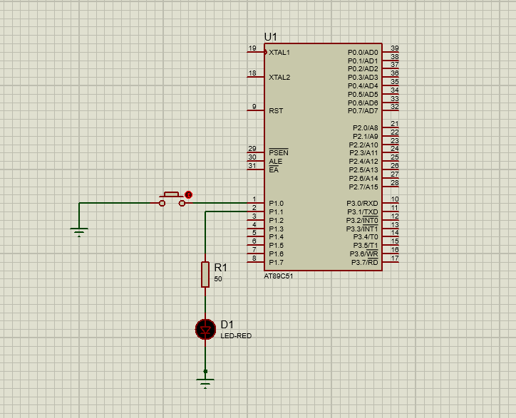

# Switch Debounce (8051 Microcontroller)

## Description
This project demonstrates how to handle push-button inputs reliably by implementing a debounce mechanism. Mechanical switches often cause multiple rapid transitions (bouncing) when pressed or released. The debounce logic ensures that only a single valid press is detected, toggling an LED accordingly.

## Files
- `switch_debounce.c` — Source code
- `switch_debounce.hex` — Compiled HEX file
- `switch_debounce.pdsprj` — Proteus simulation project
- `switch_debounce.png` — Circuit Simulation 

## Circuit Simulation

## Requirements
- Keil uVision (for compiling code)
- Proteus Design Suite (for simulation)
- AT89C51 / AT89S52 Microcontroller
- Push Button
- LED

## Procedure
1. Open `switch_debounce.c` in **Keil uVision**.
2. Compile the code (`F7` or **Build**) to generate the `.hex` file.
3. Open `switch_debounce.pdsprj` in **Proteus**.
4. Double-click the microcontroller in the schematic and load the generated `.hex` file.
5. Run the simulation and press the button to observe the LED toggling reliably without false triggers.
