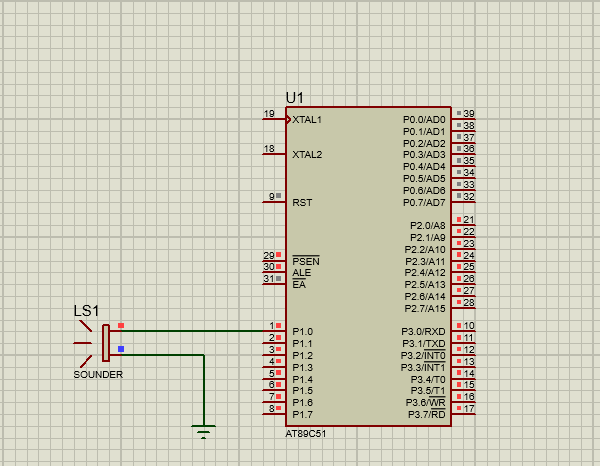

# Buzzer Melody (8051 Microcontroller)

## Description
This project generates simple beeps or melodies using a piezo buzzer connected to the 8051 microcontroller. Different frequencies are produced by toggling a port pin at varying delays, creating musical tones.

## Files
- `buzzer_melody.c` — Source code
- `buzzer_melody.hex` — Compiled HEX file
- `buzzer_melody.pdsprj` — Proteus simulation project
- `buzzer_melody.png` — Circuit Simulation 

## Circuit Simulation

## Requirements
- Keil uVision (for compiling code)
- Proteus Design Suite (for simulation)
- AT89C51 / AT89S52 Microcontroller
- Piezo Buzzer (SOUNDER)

## Procedure
1. Open `buzzer_melody.c` in **Keil uVision**.
2. Compile the code (`F7` or **Build**) to generate the `.hex` file.
3. Open `buzzer_melody.pdsprj` in **Proteus**.
4. Double-click the microcontroller in the schematic and load the generated `.hex` file.
5. Run the simulation to hear the buzzer generating beeps or melodies.
